<div id="texts" style="display:inline; white-space:nowrap; float: right;"> 
        <h1>Visual Studio Code mit Git und GitHub</h1>
</div>

# Einleitung

Unser Ziel ist es, dass Sie am Ende dieses Tutorials nicht nur die Technik hinter Codespaces verstehen, sondern auch selbstsicher und effizient in dieser modernen Entwicklungsumgebung arbeiten können. Egal, ob Sie ein Einsteiger oder ein erfahrener Entwickler sind, dieses Tutorial bietet wertvolle Erkenntnisse und Tipps für alle, die ihre Entwicklungsprozesse optimieren und in die Cloud verlagern möchten. Tauchen Sie ein und entdecken Sie die Möglichkeiten, die Ihnen durch die Kombination von Codespaces und Visual Studio Code eröffnet werden!


# Was ist ein GitHub Codespace?

Ein Codespace ist eine in der Cloud gehostete Entwicklungsumgebung. Du kannst dein Projekt für GitHub Codespaces anpassen, indem du Konfigurationsdateien in deinem Repository committest (was häufig als Configuration-as-Code bezeichnet wird). Dadurch wird eine wiederholbare Codespacekonfiguration für alle Benutzer deines Projekts erstellt.

Jeder von dir erstellte Codespace wird von GitHub in einem Docker-Container gehostet, der auf einem virtuellen Computer ausgeführt wird. Du kannst aus verschiedenen VM-Typen wählen: von 2 Kernen, 8 GB RAM und 32 GB Speicher bis hin zu 32 Kernen, 64 GB RAM und 128 GB Speicher.

Standardmäßig werden Codespaces aus einem Ubuntu Linux-Image erstellt, das eine Auswahl gängiger Sprachen und Tools enthält. Du kannst jedoch ein Image für eine Linux-Distribution deiner Wahl verwenden und es für die speziellen Anforderungen konfigurieren. Unabhängig von deinem lokalen Betriebssystem wird dein Codespace in einer Linux-Umgebung ausgeführt. Windows und macOS werden für den Remotecontainer nicht unterstützt.

Du kannst über deinen Browser, über Visual Studio Code, über die JetBrains Gateway-Anwendung oder über GitHub CLI eine Verbindung mit deinen Codespaces herstellen. Wenn du eine Verbindung herstellst, gelangst du direkt in den Docker-Container. Du hast keinen Zugriff auf den Host der übergeordneten Linux-VM.

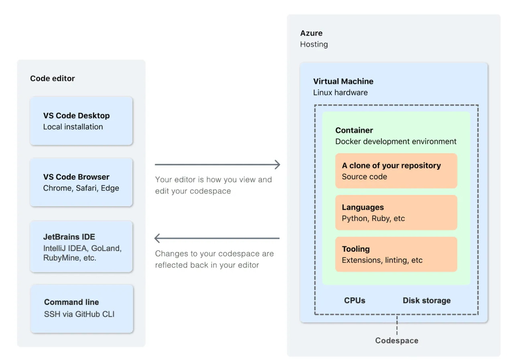


# Was ist Visual Studio Code?

Visual Studio Code (VS Code) ist ein kostenloser, plattformübergreifender Quelltext-Editor von Microsoft, verfügbar für Windows, macOS und Linux. Er basiert auf Electron und bietet Funktionen wie Syntaxhervorhebung und Debugging. Im Gegensatz zu Visual Studio fokussiert sich VS Code mehr auf Quelltext- und Textdateien statt Projektdateien und nutzt dafür Workspaces, die den Bearbeitungszustand und die Reihenfolge der geöffneten Dateien speichern. Trotz einiger Ähnlichkeiten im Namen und Funktionen wie IntelliSense hat VS Code wenig mit Visual Studio gemeinsam.

---

# Tutorial


## 1. Erstellen eines Codespaces
Um mit der Arbeit in einem Codespace zu beginnen, stellen Sie sicher, dass sich eine `.devcontainer`-Datei in Ihrem Repository befindet. Folgen Sie diesen Schritten, um Ihren Codespace zu erstellen:

+ Navigieren Sie zu dem Repository, das Sie bearbeiten möchten.
+  Klicken Sie auf die Schaltfläche **'Code'**.
+   Im Tab "Codespaces" wählen Sie **'Create codespace on main'**.

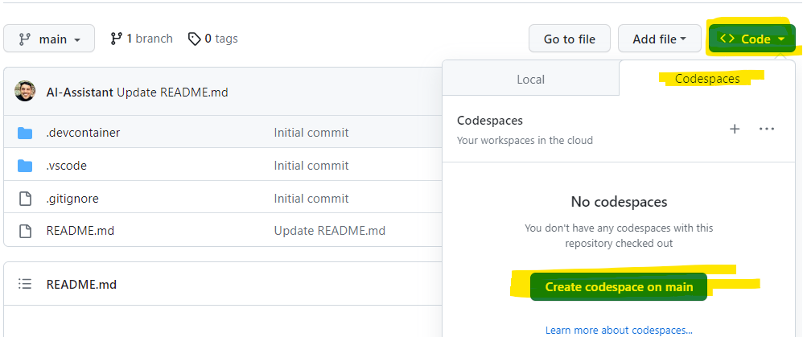

Sie werden feststellen, dass jetzt ein Container für Ihren Codespace im Hintergrund aufgesetzt wird.

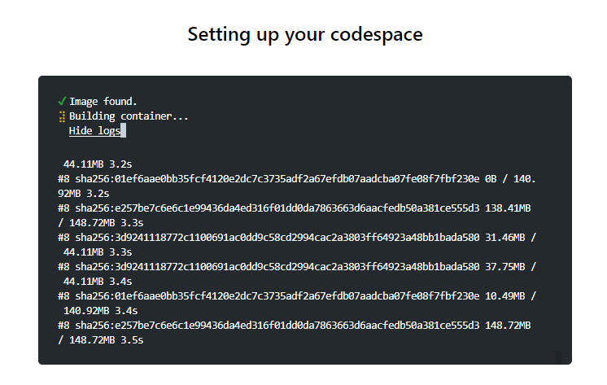


## 2. Anpassung von Visual Studio Code 

Um sicherzustellen, dass Ihre Einstellungen und Ihr Code in Visual Studio Code korrekt gespeichert und synchronisiert werden, müssen Sie die folgenden Schritte ausführen:

### Synchronisieren von Visual Studio Einstellungen

1. Klicken Sie auf das Profil-Symbol in der unteren linken Ecke.
2. Wählen Sie die Option `Turn on Settings Sync...`.
3. Im daraufhin erscheinenden Dialog klicken Sie auf `Sign in & Turn on`.
4. Melden Sie sich mit Ihrem GitHub-Profil an.

### Änderungen in der Cloud speichern

1. Klicken Sie erneut auf das Profil-Symbol in der unteren linken Ecke.
2. Wählen Sie die Option `Turn on Cloud Changes...`.
3. Klicken Sie auf `Sign in & Turn on`.
4. Authentifizieren Sie sich erneut mit Ihrem GitHub-Profil.

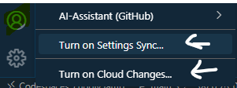
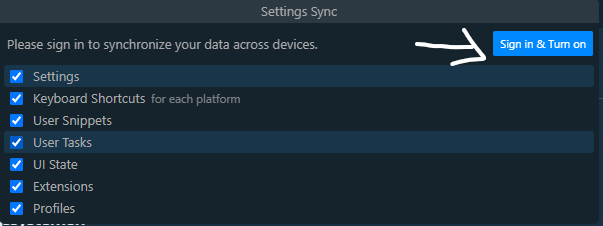


## 3. Installation von Erweiterungen in Visual Studio Code

### Was sind Erweiterungen?

Erweiterungen erweitern die Grundfunktionalität von Visual Studio Code durch zusätzliche Features. Sie ermöglichen den Benutzern, Sprachen, Debugger und verschiedene Werkzeuge ihrem Entwicklungsworkflow hinzuzufügen. Dank VS Codes flexiblen Erweiterungsmodells können Entwickler direkt in die Benutzeroberfläche von VS Code eingreifen. Diese Erweiterungen sind im Visual Studio Code Marketplace auffindbar und können von dort aus installiert und verwaltet werden.

Zum Installieren von Erweiterungen klicken Sie einfach auf das Erweiterungs-Symbol und suchen anschließend nach den gewünschten Erweiterungen.


### Empfohlene Erweiterungen

Nachfolgend sind einige Erweiterungen aufgeführt, die Sie für Ihren Workflow in Betracht ziehen sollten:

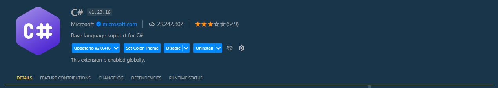
<!-- 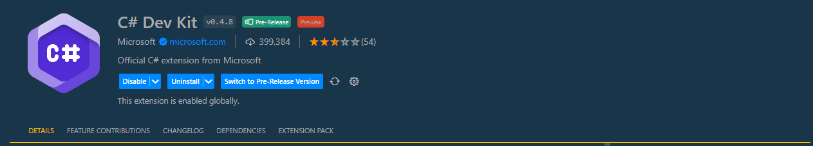
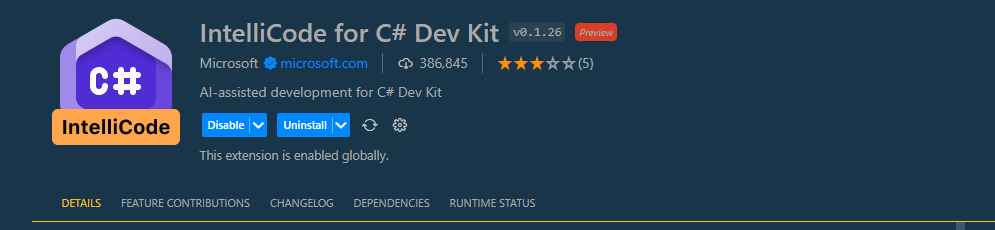 -->


### OmniSharp aktivieren

OmniSharp bietet ein Set von Werkzeugen und Integrationen, die Entwicklern, unabhängig vom Editor oder Betriebssystem, eine erstklassige Entwicklungs-Erfahrung ermöglichen. Um die volle Unterstützung für C# in VS Code zu erhalten, sollten Sie OmniSharp richtig konfigurieren:

1. Öffnen Sie die Einstellungen von VS Code mit `Strg + ,`.
2. Geben Sie in der Suche **dotnet** ein.
3. Wählen Sie die OmniSharp-Einstellungen aus.
4. Aktivieren Sie die Option **Use OmniSharp**.
5. Starten Sie den **Language Server** neu.

Ein **"hard refresh"** kann notwendig sein. Laden Sie die Seite erneut, um sicherzustellen, dass alle Einstellungen wirksam werden.

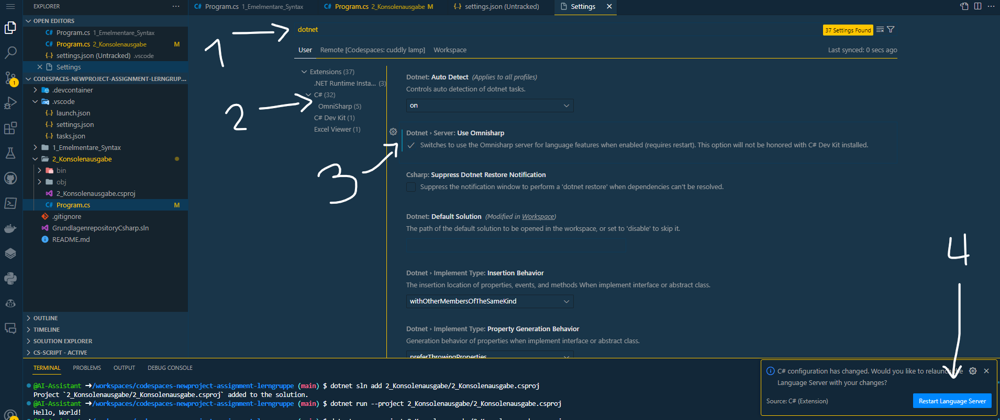

Falls Ihr Terminal geschlossen wurde, können Sie es über das "Burger"-Menü wieder öffnen.

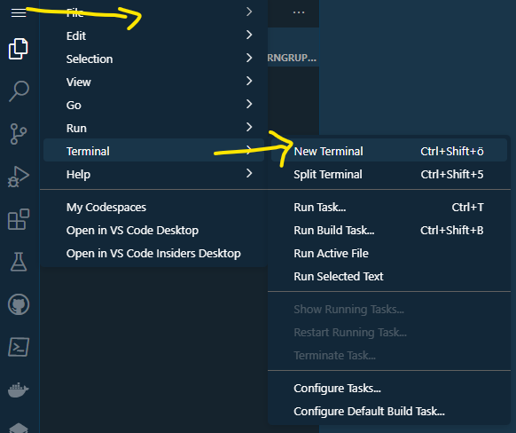

## 4. Erstellung einer neuen Projektmappe und eines Projekts

### Was ist eine Projektmappe?

In Visual Studio dient eine Projektmappe als Organisationsstruktur, um Projekte zu bündeln und zu verwalten. Während ein Projekt die tatsächlichen Code-Dateien, Ressourcen und Konfigurationen enthält, agiert die Projektmappe als übergeordneter Container für mehrere Projekte. Wenn Sie eine Projektmappe in Visual Studio öffnen, werden alle darin enthaltenen Projekte gleichzeitig geladen. Der erste Schritt beim Aufsetzen eines neuen Projekts ist oft das Erstellen einer leeren Projektmappe, in die dann die spezifischen Projekte eingefügt werden.

### Projektmappe mit dem Terminal erstellen

Um eine neue Projektmappe zu erstellen, nutzen Sie das Terminal und geben den folgenden Befehl ein:


```
dotnet new sln --name GrundlagenrepositoryCsharp
```

Erklärung der Befehlsteile:

- **dotnet**: Das Hauptwerkzeug zum Arbeiten mit .NET Core-Projekten.
- **new**: Befehl zum Erstellen einer neuen Instanz (kann für Projekte, Projektgruppen und andere Ressourcen verwendet werden).
- **sln**: Spezifiziert, dass eine neue Projektmappe (Solution) erstellt werden soll.
- **--name**: Dient zur Angabe des Namens der zu erstellenden Projektmappe oder Ressource.

Nach Ausführung des Befehls wird eine neue Projektmappe in Ihrem aktuellen Arbeitsverzeichnis erstellt.


### Erstellung eines neuen Projekts

In der .NET-Welt bezeichnet ein **"Projekt"** eine Kollektion von Dateien und Konfigurationen, die gemeinsam dazu dienen, eine bestimmte Art von Anwendung zu generieren, sei es eine Konsolenapplikation, eine Webapp oder eine Bibliothek. Typischerweise enthält ein .NET-Projekt Quellcodedateien (z.B. C#-Dateien), Ressourcendateien und eine spezielle Projektdatei. Diese Projektdatei hat meist die Endung **'.csproj'** (für C#-Projekte) und beinhaltet sowohl Metadaten über das Projekt als auch Anweisungen für dessen Kompilierung und Bau. Ein solches Projekt kann entweder eigenständig existieren oder als Teil einer umfassenden Projektmappe (Solution) mit mehreren Projekten fungieren.

Zum Anlegen eines neuen Projekts geben Sie den folgenden Befehl im Terminal ein:

```
dotnet new console --language C# --name 1_Elementare_Syntax --framework net6.0
```

Einzelheiten zu den Befehlskomponenten:
- **console**: Bestimmt, dass es sich um eine Konsolenanwendung handeln soll.
- **--language**: Legt die zu verwendende Programmiersprache fest, in diesem Fall C#.
- **--name**: Dient zur Angabe des Projektnamens.
- **--framework**: Spezifiziert die .NET-Version oder das Framework, mit dem das Projekt kompatibel sein soll.

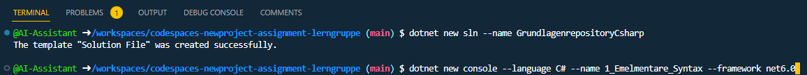

Nach Ausführung des obigen Befehls wird ein neues Konsolenprojekt mit dem angegebenen Namen und den festgelegten Einstellungen in Ihrem aktuellen Arbeitsverzeichnis erstellt.

### Ein Projekt der Projektmappe hinzufügen

Nachdem Sie ein neues Projekt erstellt haben, ist es häufig erforderlich, dieses zu einer bestehenden Projektmappe hinzuzufügen. Dies ermöglicht es, mehrere Projekte zentral zu verwalten und sie als zusammenhängende Einheit zu betrachten. 

Führen Sie den nachfolgenden Befehl im Terminal aus, um das vorher erstellte Projekt der Projektmappe hinzuzufügen:


```
dotnet sln add 1_Elementare_Syntax/1_Elementare_Syntax.csproj
```


Um zu überprüfen, welche Projekte sich bereits in der Projektmappe befinden und sicherzustellen, dass Ihr neues Projekt erfolgreich hinzugefügt wurde, können Sie den folgenden Befehl verwenden:

```
dotnet sln GrundlagenrepositoryCsharp.sln list
```

Das Ergebnis dieses Befehls listet alle Projekte auf, die der Projektmappe hinzugefügt wurden. 

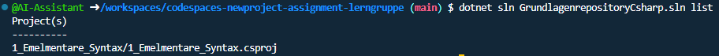

### Projekt ausführen und Debuggen

Ein tiefgreifendes Verständnis der Softwareentwicklung erfordert die Fähigkeit, sowohl die Ausführung von Code als auch das Debugging zu verstehen und zu steuern.

#### Ausführen eines Programms
Die Ausführung eines Programms ermöglicht es Ihnen, den Code von Anfang bis Ende laufen zu lassen und zu sehen, wie er in einer Live-Umgebung arbeitet. Um das Projekt **'1_Elementare_Syntax'** zu starten, führen Sie den folgenden Befehl aus:

```
dotnet run --project 1_Elementare_Syntax/1_Elementare_Syntax.csproj
```
Bedeutung der Befehlskomponenten:   
**run**: Befiehlt dem .NET Core SDK, das Projekt auszuführen.      
**--project**: Spezifiziert welches Projekt ausgeführt werden soll.      


**Codezeilen hinzufügen und das Programm neu starten:**

- Navigieren Sie im Arbeitsverzeichnis zum Projekt **'1_Elementare_Syntax'** und öffnen Sie die Datei **'Program.cs'**.
- Fügen Sie unter der bereits vorhandenen Codezeile den folgenden Befehl ein:`Console.WriteLine("Hallo, Welt!");`.
- Führen Sie das Programm erneut aus, um die Änderungen zu sehen.

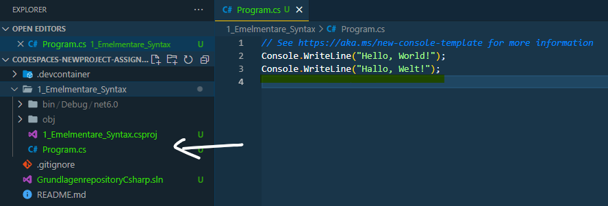
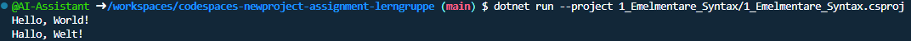

**Debugger:** Ein Debugger ist ein spezialisiertes Tool, das Entwicklern ermöglicht, ein Programm in einer kontrollierten Umgebung auszuführen, um Fehler zu finden und zu beheben. Mit einem Debugger können Entwickler das Programm schrittweise ausführen, Haltepunkte setzen, um die Ausführung an bestimmten Punkten zu stoppen, und den aktuellen Zustand des Programms (wie Variablenwerte) überwachen. Dies gibt einen detaillierten Einblick in das Verhalten des Programms und ermöglicht es, Probleme oder unerwartetes Verhalten zu identifizieren und zu korrigieren.

**Den Debugger verwenden: **

1. Setzen Sie einen Haltepunkt, indem Sie links neben die Zeilennummer klicken.
2. Starten Sie den Debugger mit **F5**. ❗❗ (Nun müsste sich ein Json-Datei öffnen ist das der fall, führen Sie die folgende Einstellung aus)
3. Überprüfen Sie das Terminal, um den aktuellen Ausführungsstand zu sehen.
4. erwenden Sie den **'PLay-Button'**, um den Debugger fortzusetzen.

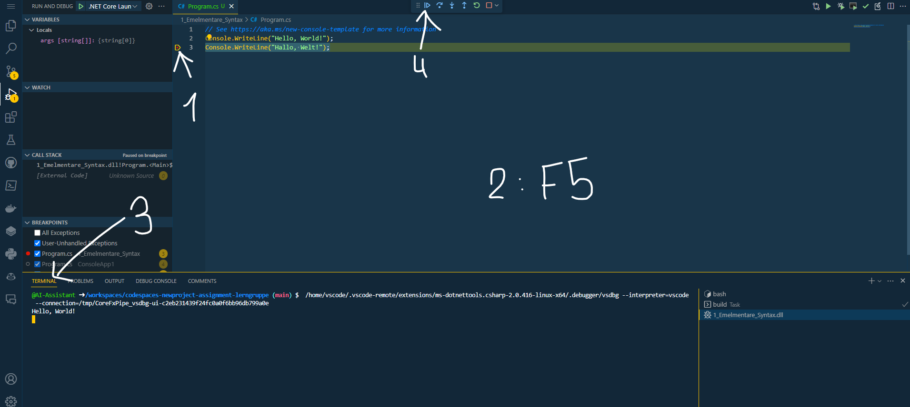

**Debugger-Konfiguration:**

Wenn sich eine JSON-Datei geöffnet hat, ist das in der Regel ein gutes Zeichen. Ändern Sie in dieser Datei den Wert von **"console"** zu `"integratedTerminal"`. Speichern Sie die Änderungen und schließen Sie die Datei.

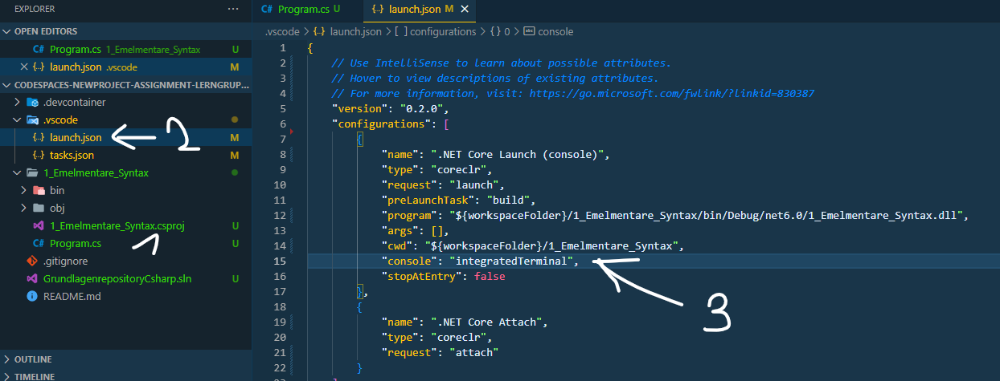

### Zweite Projektmappe hinzufügen

Erstellen Sie eine zweite Projektmappe mit dem Namen `2_Konsolenausgabe`. 
Fügen Sie dieses Projekt auch der Projektmappe hinzu.

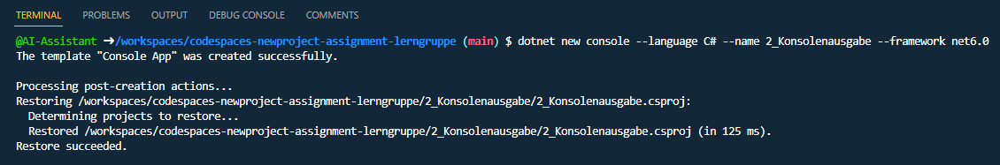

## 5. Commiten und Pushen

### Was ist ein Commit  

Ein Commit ist ein Begriff aus der Versionskontrolle und bezeichnet die Aktion, bei der Änderungen an einer oder mehreren Dateien in einem Repository gespeichert werden. Mit einem Commit werden nicht nur die eigentlichen Änderungen gespeichert, sondern auch eine Commit-Nachricht hinzugefügt, die beschreibt, was und warum etwas geändert wurde. Jeder Commit in einem Repository hat eine eindeutige ID, sodass man zu jedem Zeitpunkt zu einem bestimmten Commit zurückkehren kann. Commits ermöglichen es also, die Entwicklungshistorie eines Projekts nachzuvollziehen und bei Bedarf zu einem früheren Stand des Projekts zurückzukehren.

Um einen Commit ind VS Code durchzuführen, müssen Sie folgende Schritte durchführen: 

1. Klicken Sie auf das Branch-Symbol in der Seitenleiste.
2. Fügen Sie alle Änderungen mit einem Klick auf das `+` -Symbol hinzu.
3. Geben Sie eine kurze Beschreibung Ihrer Änderungen in das Eingabefeld ein.
4. Bestätigen Sie den Commit mit einem Klick auf das Commit-Symbol.

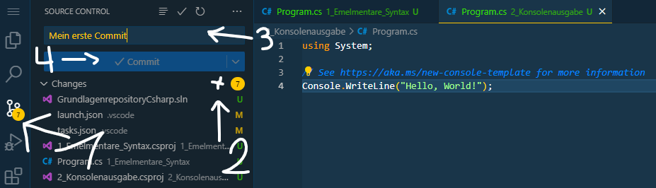

### Warum muss ich noch Pushen?

Nach einem Commit sind die Änderungen nur im lokalen Repository des Entwicklers gespeichert. Das Pushen (oder Hochladen) dieser Änderungen ist notwendig, um sie in ein entferntes Repository (z. B. auf einem Server oder bei einem Dienst wie GitHub) zu übertragen. Dadurch werden die Commits für andere Entwickler zugänglich, und sie können die neuesten Änderungen abrufen und in ihre eigenen lokalen Kopien des Projekts integrieren. Ohne den Push-Vorgang wären die Commits nur lokal verfügbar und könnten nicht von anderen Teammitgliedern oder Systemen gesehen oder genutzt werden.

Um die Änderungen bei VS Code zu pushen, klicken sie im Register von Git auf die drei Punkte `...`
und anschließend auf `Push`. Schauen Sie ob die Änderungen bei GitHub zu sehen sind.

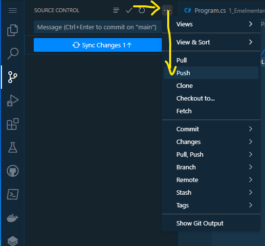

## 6. Fetch und Pull

**Gehen Sie zu Ihrem GitHub-Repository**

Es könnte vorkommen, dass Sie selbst oder ein/e Kolleg/in eine Änderung direkt im GitHub-Repository durchführt. Um dies zu simulieren, ändern Sie im Projekt **'2_Konsolenausgabe'** in der Datei **'Program.cs'** den Code zu `Console.WriteLine("foobar");`. 

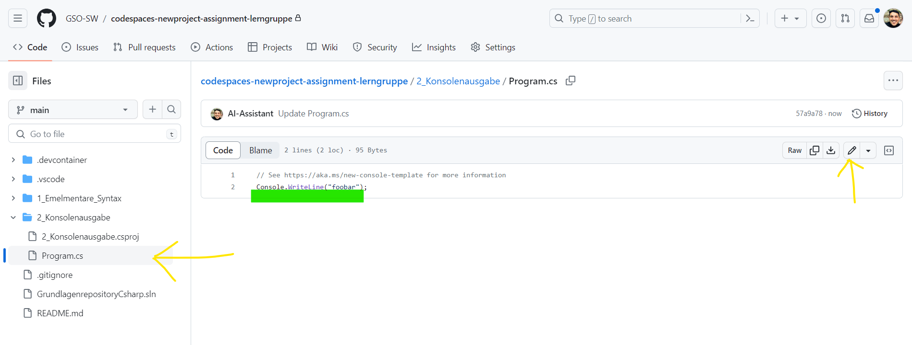

**Gehen Sie nun wieder zu ihrem Codespace und Visual Studio Code**

### Was ist Fetching

Ein **'Fetch'** in Git ermöglicht es Ihnen, die neuesten Änderungen aus einem entfernten Repository abzurufen, ohne sie automatisch mit Ihrem aktuellen Branch zu verschmelzen. Es holt im Wesentlichen die Updates, führt aber keinen Merge durch, sodass Sie die Änderungen überprüfen können, bevor Sie sie in Ihre Arbeitskopie integrieren.

Um die Änderungen abzurufen, gehen Sie wieder auf das Git Register und klicken Sie die drei Punkte an `...`. Klicken Sie `Fetch` um die Änderungen anzufragen. 

❗ Schauen Sie jetzte in die **'Program.cs'** so sehen Sie, das die Änderungen noch nicht übernommen wurden. 

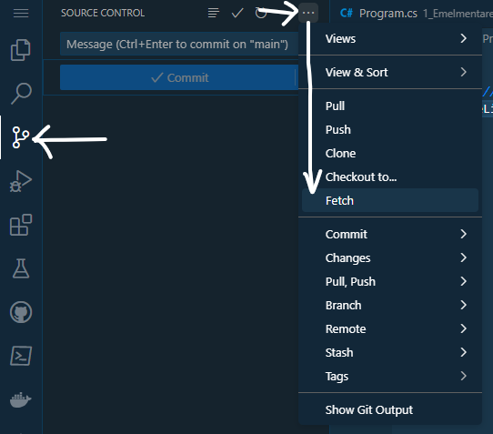

### Was bedeutet Pull

Mit einem **'Pull'** werden die neuesten Änderungen aus einem entfernten Repository abgerufen und automatisch mit dem aktuellen Branch in Ihrem lokalen Repository verschmolzen. Das bedeutet, wenn Sie einen **'Pull'** ausführen, aktualisieren Sie Ihre lokale Arbeitskopie direkt mit den neuesten Änderungen aus dem entfernten Repository.

Sie können die Änderungen pullen indem Sie über die drei Punkte `...` den Befehl `Pull` anklicken oder direkt auf den Synchronisations-Button klicken.


